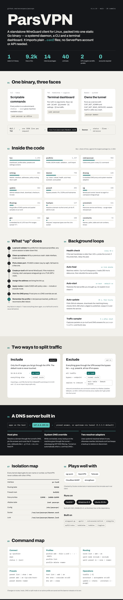

# ParsVPN

Standalone, Linux-only WireGuard VPN client for ServerPars. Single static binary with a systemd daemon, Cobra CLI, and Bubbletea TUI. Imports standard WireGuard `.conf` files — no ServerPars API or account required.

## Design goals

- Coexist with `wg-quick`, OpenVPN, Tailscale, WARP, StrongSwan
- Auto listen-port fallback when `51820` (or the profile port) is already taken (e.g. by `wg0`)
- Isolated interface `pv-tun0`, routing table `51920`, rule priorities `13990` + `14000–16999`
- Split-tunnel by destination CIDR (never steals the default route by default)
- Optional exclude mode: tunnel all traffic except bypass CIDRs (e.g. Iran)
- Exclude-mode return-path: conntrack/fwmark keeps replies to inbound connections on the main table (SSH, CDN, reverse proxy)
- Optional system DNS override via embedded resolver on `127.0.0.199:53`
- Optional host overrides via the same embedded DNS
- Static ELF (`CGO_ENABLED=0`) for CentOS 7 / AlmaLinux 8–9 / Ubuntu 20.04+

## Infographic
  <details>
  <summary><b>📊 Infographic: how ParsVPN works</b></summary>
  
  </details>

## Install

One-line install (Linux):

```bash
sudo bash -c "$(curl -fsSL https://raw.githubusercontent.com/serverpars/parsvpn/main/scripts/install.sh)"
```

```bash
# From a prebuilt binary
sudo ./scripts/install.sh ./dist/parsvpn-linux-amd64

# Or build locally (on Linux / WSL)
./scripts/build.sh
sudo ./scripts/install.sh ./dist/parsvpn-linux-amd64
```

## Usage

```bash
# Import a WireGuard config
sudo parsvpn profile add --file ./office.conf --name office

# Paste / pipe a WireGuard config
cat office.conf | sudo parsvpn profile add --file - --name office

# Create an empty tunnel (edit the JSON before connecting)
sudo parsvpn profile add --empty --name scratch

# Connect / disconnect
sudo parsvpn up office
parsvpn status --json
sudo parsvpn down

# Auto-connect after reboot (default: on). Explicit down clears the saved profile.
parsvpn autostart                 # shows: autostart on/off + which profile reconnects
sudo parsvpn autostart off
sudo parsvpn autostart on

# Interactive dashboard (press [a] add; [e] edit; [p] presets; [s] settings)
sudo parsvpn

# Check / install updates (daemon also auto-updates by default)
parsvpn update --check
sudo parsvpn update
sudo parsvpn update --disable-auto   # opt out of autopilot

# Uninstall (keeps /etc/parsvpn unless --purge)
sudo parsvpn uninstall
sudo parsvpn uninstall --purge --yes
```

### Settings (TUI)

Press **[s]** in the dashboard to change global options:

| Setting | What it does |
|---------|----------------|
| Auto-update | Unattended GitHub release installs (default on) |
| Auto-start | Reconnect last profile after reboot (default on) |
| Update check interval | How often the daemon polls for releases |
| Reconnects as | Which profile auto-start restores (`c` clears it) |

CLI: `parsvpn autoupdate on|off`, `parsvpn autostart on|off`.

### Presets (TUI)

Press **[p]** to manage bypass presets (same as `parsvpn preset …`). Apply a preset to a profile via **[e] → Split** (select `ir`, `none`, or any custom preset).

### Routes, hosts, DNS, and split mode

```bash
# List / add / remove split IP ranges (include: via tunnel; exclude: bypass)
parsvpn route list office
sudo parsvpn route add office 10.10.0.0/16 203.0.113.0/24
sudo parsvpn route rm office 203.0.113.0/24

# DNS host overrides (embedded resolver pins)
parsvpn host list office
sudo parsvpn host add office example.com          # resolve via tunnel DNS, pin + route
sudo parsvpn host add office example.com --www    # also pin www.example.com
sudo parsvpn host add office '*.github.com'       # all subdomains → same IP (resolves github.com)
sudo parsvpn host add office db.internal 10.10.0.50  # optional explicit IP
sudo parsvpn host rm office example.com

# Override system DNS while connected (bypasses ISP filtering e.g. youtube → 10.10.34.35)
parsvpn dns show office
sudo parsvpn dns override office on          # forward all DNS via tunnel (1.1.1.1 by default)
sudo parsvpn dns set office 1.1.1.1 8.8.8.8  # set upstream + enable override
sudo parsvpn dns override office off

# Tunnel everything except Iran (preset enables exclude mode)
sudo parsvpn split preset office ir
sudo parsvpn up office

# Custom bypass presets (IPs, CIDRs, hosts) — stored in /etc/parsvpn/presets/
sudo parsvpn preset new office-net
sudo parsvpn preset add office-net 10.0.0.0/8 1.2.3.4 intranet.local '*.corp.example'
parsvpn preset show office-net
sudo parsvpn split preset office office-net   # apply to profile (exclude mode)
sudo parsvpn preset rm office-net 1.2.3.4
sudo parsvpn preset delete office-net

# Live traffic debug (DNS queries + packets on pv-tun0)
parsvpn traffic
parsvpn traffic -f            # follow
# TUI: press [t]

# Back to classic split-tunnel (only listed CIDRs via VPN)
sudo parsvpn split mode office include
sudo parsvpn split preset office none
```

If the profile is active, route/host/dns/split changes are saved and the daemon reloads automatically.

Daemon (started by systemd):

```bash
sudo systemctl status parsvpn
```

## Profile JSON

Profiles live in `/etc/parsvpn/profiles/<name>.json` (`0600`). Importing a `.conf` fills `split_tunnel.ip_ranges` from peer `AllowedIPs`, dropping `0.0.0.0/0` and `::/0` so include-mode stays split-only.

```json
{
  "name": "office",
  "private_key": "...",
  "address": "10.200.0.2/32",
  "dns": ["1.1.1.1"],
  "override_system_dns": true,
  "peers": [
    {
      "public_key": "...",
      "endpoint": "198.51.100.25:51820",
      "persistent_keepalive": 25,
      "allowed_ips": ["10.10.0.0/16"]
    }
  ],
  "split_tunnel": {
    "mode": "include",
    "bypass_preset": "",
    "ip_ranges": ["10.10.0.0/16"],
    "host_overrides": [
      {"domain": "db.internal", "ip": "10.10.0.50"}
    ]
  }
}
```

- `mode: "include"` (default): `ip_ranges` go through the tunnel.
- `mode: "exclude"`: everything goes through the tunnel except `ip_ranges` plus `bypass_preset` (e.g. `"ir"` for Iran IPv4). WireGuard AllowedIPs are forced to include `0.0.0.0/0`; the peer endpoint is always bypassed. Inbound connections that arrive on a non-tunnel interface are conntrack-marked (`fwmark 0x5192`) so their replies stay on the main table (fixes SSH/CDN/reverse-proxy breakage under full-tunnel).
- `override_system_dns: true`: while connected, all system DNS is routed through the embedded proxy to `dns` (or `1.1.1.1`). Importing a WireGuard conf with `DNS=` enables this automatically.

## Isolation map

| Component | Value |
|-----------|--------|
| Interface | `pv-tun0` |
| Table | `51920` |
| FwMark | `0x5192` (exclude-mode return-path) |
| Rule prefs | `13990` (return-path), `14000–16999` (split/bypass/catch-all) |
| nftables | `inet parsvpn` (exclude-mode CONNMARK; iptables fallback) |
| Config | `/etc/parsvpn/` (`profiles/`, `config.json`) |
| Socket | `/var/run/parsvpn/daemon.sock` |
| Lock | `/var/run/parsvpn/daemon.lock` |

## Updates

ParsVPN checks GitHub releases (`serverpars/parsvpn`) for newer versions.

- **Autopilot / autoupdate (default on):** the daemon checks GitHub ~45s after start, then about every hour, and installs newer releases unattended (service restart). Toggle: `parsvpn autoupdate on|off`.
- **Auto-connect (default on):** after reboot, the daemon brings up the last profile from `parsvpn up`. Disable with `parsvpn autostart off` or `"auto_connect": false` in `/etc/parsvpn/config.json`. Explicit `parsvpn down` clears the saved profile.
- **Manual:** `parsvpn update --check` / `sudo parsvpn update` (CLI/TUI re-exec into the new binary after install)
- **Opt out of updates:** `sudo parsvpn autoupdate off` or `sudo parsvpn update --disable-auto` or `"auto_update": false` in `/etc/parsvpn/config.json`

## Development

```bash
go test ./...
GOOS=linux GOARCH=amd64 CGO_ENABLED=0 go build -o dist/parsvpn ./cmd/parsvpn
```

Coexistence smoke tests: see [`tests/coexist/`](tests/coexist/).

## License

Proprietary — ServerPars / pars.host
